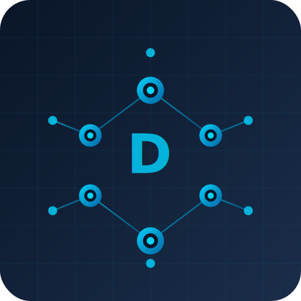

<div align="center">



# DigiOrg

### Das digitale Rückgrat der vollständig digitalisierten Organisation
### *The Digital Backbone of a Fully Digitalized Organization*

[](http://digiorg.cloud)
[](https://it-stud.io)

</div>

---

## 🇩🇪 Deutsch

**DigiOrg** ist das Flaggschiff-Projekt von [it-stud.io](https://it-stud.io) und verkörpert die Vision einer vollständig digitalisierten Organisation. Im Kern steht eine zentrale Architektur – das digitale Rückgrat – die Tools und Prozesse für die vollständig digitale Verwaltung, Entwicklung, Wartung und den Betrieb von IT-Infrastruktur und -Anwendungslandschaften bereitstellt.

### 🎯 Vision

Eine digitalisierte IT ist die Basis für digitale Geschäftsprozesse und Produkte. DigiOrg liefert das Fundament, um diese Vision Wirklichkeit werden zu lassen.

### 🏗️ Architektur-Ebenen

```
┌─────────────────────────────────────────────────────────┐
│           🏭 Industry Solutions Layer                   │
│              (Branchenspezifische Lösungen)             │
├─────────────────────────────────────────────────────────┤
│           🔗 Business Integration Layer                 │
│         (Geschäftsprozess-Integration)                  │
├─────────────────────────────────────────────────────────┤
│           ⚙️ Digital IT Foundation Layer                │  ◄── Aktueller Fokus
│    DevSecOps · IDP · CMDB · Multicloud Control Plane    │
└─────────────────────────────────────────────────────────┘
```

### 🔧 Kernkomponenten (Digital IT Foundation)

| Komponente | Beschreibung |
|------------|--------------|
| **DevSecOps Platform** | Integrierte Plattform für sichere, automatisierte Softwareentwicklung und -bereitstellung |
| **Multicloud Control Plane** | Zentrale Verwaltung von IaaS- und PaaS-Ressourcen über verschiedene Cloud-Provider hinweg |
| **CMDB** | Configuration Management Database für alle IT-Assets – interne und externe Anwendungen (Custom Dev, Off-the-Shelf, SaaS, PaaS) |
| **Internal Developer Platform (IDP)** | Strukturierte und standardisierte Umgebung für Custom Application Development |

### 🔌 Integrationen

DigiOrg ist als offene, erweiterbare Plattform konzipiert und integriert sich nahtlos mit marktüblichen Lösungen:

- **IAM:** Entra ID, Okta, etc.
- **Monitoring:** Dynatrace, Datadog, etc.
- **ITSM:** ServiceNow, Jira Service Management, etc.

---

## 🇬🇧 English

**DigiOrg** is the flagship project of [it-stud.io](https://it-stud.io), embodying the vision of a fully digitalized organization. At its core lies a central architecture – the digital backbone – providing tools and processes for the complete digital management, development, maintenance, and operation of IT infrastructure and application landscapes.

### 🎯 Vision

A digitalized IT is the foundation for digital business processes and products. DigiOrg provides the foundation to make this vision a reality.

### 🏗️ Architecture Layers

```
┌─────────────────────────────────────────────────────────┐
│           🏭 Industry Solutions Layer                   │
│              (Industry-specific Solutions)              │
├─────────────────────────────────────────────────────────┤
│           🔗 Business Integration Layer                 │
│           (Business Process Integration)                │
├─────────────────────────────────────────────────────────┤
│           ⚙️ Digital IT Foundation Layer                │  ◄── Current Focus
│    DevSecOps · IDP · CMDB · Multicloud Control Plane    │
└─────────────────────────────────────────────────────────┘
```

### 🔧 Core Components (Digital IT Foundation)

| Component | Description |
|-----------|-------------|
| **DevSecOps Platform** | Integrated platform for secure, automated software development and deployment |
| **Multicloud Control Plane** | Centralized management of IaaS and PaaS resources across multiple cloud providers |
| **CMDB** | Configuration Management Database for all IT assets – internal and external applications (custom dev, off-the-shelf, SaaS, PaaS) |
| **Internal Developer Platform (IDP)** | Structured and standardized environment for custom application development |

### 🔌 Integrations

DigiOrg is designed as an open, extensible platform that seamlessly integrates with industry-standard solutions:

- **IAM:** Entra ID, Okta, etc.
- **Monitoring:** Dynatrace, Datadog, etc.
- **ITSM:** ServiceNow, Jira Service Management, etc.

---

<div align="center">

### 📬 Kontakt / Contact

[](https://it-stud.io)
[](https://github.com/ITSTUD-IO)

---

*Ein Projekt von / A project by* **[it-stud.io](https://it-stud.io)**

</div>
